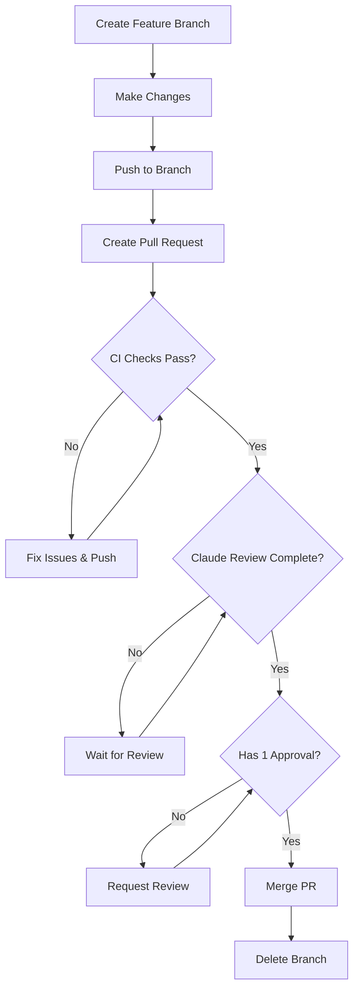

# Branch Protection Setup Guide

This guide provides step-by-step instructions for manually setting up branch protection rules for the GoTuto project after discovering that automated GitHub Settings apps have reliability issues.

## 🎯 Overview

Branch protection ensures code quality by requiring pull requests, status checks, and reviews before changes can be merged to the main branch. This is essential for maintaining a professional development workflow.

## 📋 Prerequisites

- Repository owner/admin permissions on `Gaetan-Jaminon/GoTuto`
- Existing CI/CD workflows (`ci.yml`, `claude-code-review.yml`) 
- Understanding of the current workflow setup

## 🔧 Manual Setup Steps

### Step 1: Access Branch Protection Settings

1. **Navigate to Repository Settings**
   - Go to https://github.com/Gaetan-Jaminon/GoTuto
   - Click **Settings** tab (top navigation)
   - Click **Branches** in the left sidebar

2. **Add Protection Rule**
   - Click **"Add rule"** button
   - Enter branch name pattern: `main`

### Step 2: Configure Protection Rules

#### Required Status Checks
✅ **Check**: "Require status checks to pass before merging"
✅ **Check**: "Require branches to be up to date before merging"

**Add these status checks**:
- `Continuous Integration` (from ci.yml workflow)
- `claude-review` (from claude-code-review.yml workflow)

#### Pull Request Requirements  
✅ **Check**: "Require a pull request before merging"
✅ **Check**: "Require approvals" → Set to **1** required review
✅ **Check**: "Dismiss stale pull request approvals when new commits are pushed"
❌ **Uncheck**: "Require review from code owners" (not needed for learning project)

#### Additional Restrictions
✅ **Check**: "Restrict pushes that create files in protected paths"
- Add path: `.github/workflows/*`
- Add path: `.github/settings.yml`

❌ **Uncheck**: "Require conversation resolution before merging" (optional for learning)
❌ **Uncheck**: "Require signed commits" (not needed for learning project)
❌ **Uncheck**: "Require linear history" (allows merge commits)

#### Admin Settings
❌ **Uncheck**: "Do not allow bypassing the above settings" 
   - Keep unchecked so you can bypass rules during learning

✅ **Check**: "Allow force pushes" → Select "Everyone" 
   - Useful for learning and fixing mistakes

❌ **Uncheck**: "Allow deletions"
   - Prevents accidental branch deletion

### Step 3: Save and Verify

1. **Save Protection Rule**
   - Click **"Create"** button at bottom
   - Verify the rule appears in the list

2. **Test Protection**
   - Try pushing directly to main (should be blocked)
   - Create a test branch and PR to verify workflow

## 🔍 Verification Checklist

After setup, verify the following works correctly:

### ✅ Direct Push Prevention
```bash
# This should be blocked
git checkout main
echo "test" >> README.md
git add README.md
git commit -m "Direct push test"
git push origin main  # Should fail with protection error
```

### ✅ Pull Request Workflow
```bash
# This should work
git checkout -b test-branch
echo "test change" >> README.md  
git add README.md
git commit -m "Test PR workflow"
git push origin test-branch
# Create PR via GitHub UI - should trigger CI and Claude review
```

### ✅ Status Checks Required
- Create a PR that breaks tests
- Verify merge is blocked until CI passes
- Verify Claude review appears automatically

### ✅ Review Requirements
- PR cannot be merged without 1 approval
- Author can approve their own PR (learning project setting)
- Stale reviews are dismissed when new commits pushed

## 🚨 Troubleshooting

### Issue: Status Check Not Found
**Problem**: GitHub shows "Expected — Waiting for status to be reported"

**Solution**: 
1. Status check names are case-sensitive
2. Must match exactly: `Continuous Integration` (not `continuous-integration`)
3. Check workflow file names and job names match

### Issue: CI Not Triggering
**Problem**: Push to PR branch doesn't trigger workflows

**Solution**:
1. Check workflow `paths` filters in `.github/workflows/ci.yml`
2. Ensure changes are in `/api` directory 
3. Verify workflow syntax with `gh workflow list`

### Issue: Cannot Bypass Protection
**Problem**: Even as admin, cannot push or merge

**Solution**:
1. Go to Settings → Branches → Edit rule
2. Uncheck "Do not allow bypassing the above settings"
3. Or temporarily disable the rule for emergency fixes

### Issue: Claude Review Not Required
**Problem**: Can merge PR without Claude review completing

**Solution**:
1. Check status check name matches workflow: `claude-review`
2. Verify Claude OAuth token is configured: `gh secret list`
3. Test Claude review with `@claude` mention in PR

## 📊 Expected Workflow

With protection enabled, the development flow becomes:



## 🎓 Learning Benefits

This manual protection setup provides:

1. **Professional Workflow**: Mimics enterprise development practices
2. **Code Quality**: Prevents broken code from reaching main branch  
3. **Review Culture**: Encourages thoughtful code review process
4. **CI/CD Integration**: Ensures automated testing before merge
5. **AI Assistance**: Leverages Claude for automatic code review

## 🔄 Future Considerations

### When to Update Rules
- **Add new status checks**: When adding new workflow jobs
- **Modify review requirements**: As team grows or project complexity increases
- **Adjust bypass permissions**: Based on project maturity and team trust

### Alternative Automation
If you later want to automate branch protection:

1. **GitHub Actions**: Create workflow to apply settings via API
2. **Organization Setup**: Move to GitHub organization for Safe-Settings app
3. **Terraform**: Use infrastructure-as-code for GitHub management

### Integration with Learning Goals
- Practice creating meaningful commit messages
- Learn to write good PR descriptions  
- Experience code review feedback loops
- Understand CI/CD pipeline integration

## 📚 Related Documentation

- [GitHub Branch Protection Docs](https://docs.github.com/en/repositories/configuring-branches-and-merges-in-your-repository/defining-the-mergeability-of-pull-requests/about-protected-branches)
- [CI/CD Workflow Documentation](./claude-github-integration.md)
- [Go Testing Patterns](./go-testing-patterns.md)
- [Development Workflow](./development-workflow.md)

---

**Next Steps**: Follow this guide tomorrow to manually configure branch protection, then test the complete development workflow with a sample feature branch and pull request.